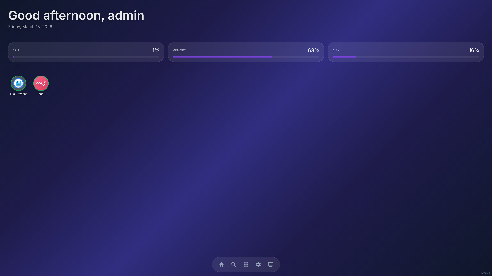

<p align="center">
  <h1 align="center">Tomo</h1>
</p>

<p align="center">
  <strong>Self-hosted app platform with a desktop-in-browser experience</strong>
</p>

<p align="center">
  
  
  
  
  
</p>

---

Install apps with one click, manage everything from a beautiful desktop interface — right in your browser. Powered by the Umbrel app store (300+ apps), plus support for custom Docker apps and external service shortcuts.

<p align="center">
  
</p>

## Quick Start

Download the `.deb` package for your architecture from the [latest release](https://github.com/cbabil/tomo/releases/latest), then install it:

```bash
sudo apt install ./tomo_0.0.60_amd64.deb   # x86_64
# or
sudo apt install ./tomo_0.0.60_arm64.deb   # ARM64 (Raspberry Pi, etc.)
```

Then open `http://your-server-ip` in your browser (default port 80).

> **Note:** Requires a Debian-based Linux system with root access. Docker and Node.js are installed automatically if not present.

## Development

### Prerequisites

| Tool | Version | Install |
|------|---------|---------|
| **Bun** | latest | `curl -fsSL https://bun.sh/install \| bash` |
| **Node.js** | 22+ | [nodejs.org](https://nodejs.org) |
| **Docker** | 20.10+ | [docs.docker.com](https://docs.docker.com/get-docker/) |

### Setup

```bash
git clone https://github.com/cbabil/tomo.git
cd tomo
make setup    # installs deps, creates .env and data directory
make dev      # starts tomod (port 3001) + ui (port 5173)
```

Open `http://localhost:5173` in your browser.

Edit `.env` to change ports, data directory, or log level. See `.env.example` for all available options.

### Available Commands

Run `make help` for the full list. Key targets:

| Command | Description |
|---------|-------------|
| `make setup` | Install all dependencies |
| `make dev` | Run tomod + ui in parallel |
| `make build` | Production build |
| `make test` | Run all tests |
| `make lint` | Lint all packages |
| `make typecheck` | Type check all packages |
| `make docker-build-proxy` | Build the app-proxy Docker image |
| `make deb` | Build .deb package (amd64) |

## Custom Apps

Beyond the Umbrel app store, Tomo supports two additional ways to add apps:

- **Custom Docker App** — Provide a Docker image + port (or a full `docker-compose.yml`). Tomo manages the container lifecycle, Traefik routing, and desktop integration.
- **External Service Shortcut** — Point to an already-running service URL. It appears on the desktop and opens in a new tab when clicked.

Click the **+** button in the App Store to get started. Both types appear alongside store apps and are manageable via right-click context menu.

## Project Structure

```
tomo/
├── packages/
│   ├── tomod/            # Node.js daemon (Express + tRPC)
│   └── ui/               # React 19 desktop shell (Vite + MUI)
├── containers/
│   └── app-proxy/        # Auth proxy sidecar
├── scripts/
│   └── install.sh        # One-liner installer
├── docker/
│   └── docker-compose.yml
├── .env.example          # Environment variable reference
└── package.json          # Bun workspaces
```

## License

Proprietary — All rights reserved. See [LICENSE](LICENSE) for details.
